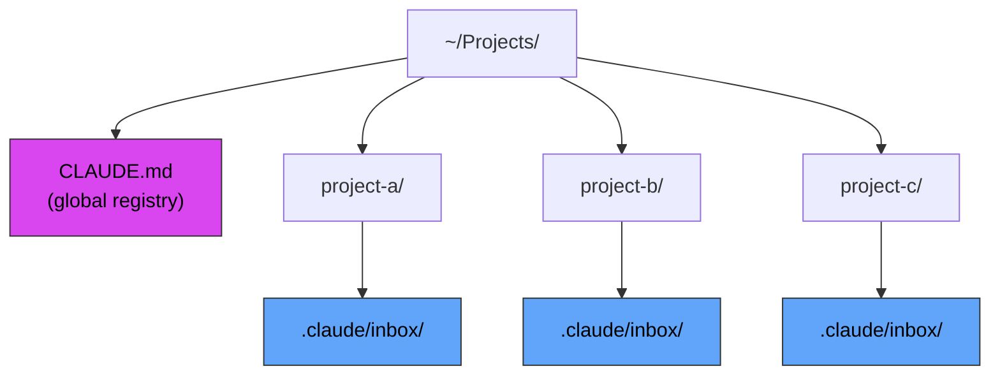

# Inbox

Cross-project messaging for Claude Code. Ask Claude in other projects to fix bugs, review code, or handle tasks for you.

## Problem

Claude Code instances working on different projects cannot directly communicate. This plugin provides a standardized way to leave messages for other instances.

## How It Works

1. Messages are stored in `.claude/inbox/` within each project
2. Structured markdown files with YAML frontmatter
3. `messenger` agent sends, target project's Claude reads its inbox directly

## Requirements

### Flat Project Structure

This plugin requires a **flat directory structure** where all projects are siblings under a common parent directory:



**Why?** The messenger agent navigates between projects using relative paths (`../other-project/`). Nested or scattered project structures will not work.

## Setup

### 1. Install plugin (user-level)

**This plugin MUST be installed globally (user-level), not per-project.**

Why? The messenger agent needs to write to OTHER projects' inbox directories. Project-level installation only has access to the current project.

```shell
/plugin marketplace add maledorak-marketplace
/plugin install inbox@maledorak-marketplace --user
```

### 2. Run automatic setup (recommended)

After installing the plugin, ask Claude:

```
Setup inbox
```

Claude will:
- Create or update parent `CLAUDE.md` with project registry
- Ask you about 2-3 initial projects to add
- Show you what to add to `~/.claude/settings.json`
- Setup inbox and gitignore for current project

**Or manual setup** - create `CLAUDE.md` in your **parent projects directory** (e.g., `~/Projects/CLAUDE.md`):

```markdown
# Global Context

## Projects

| Project | Purpose |
|---------|---------|
| project-a | Description of project A |
| project-b | Description of project B |

## Cross-Instance Messaging

Inbox location: `{project}/.claude/inbox/`
```

**Required columns:** `Project`, `Purpose`. You can add more columns like `Client`, `Notes`, `Status` - they'll be preserved.

**Already have parent CLAUDE.md?**

Claude will ask permission to add the required sections (Projects table, Cross-Instance Messaging) matching your existing style.

### 3. Configure permissions

Add to `~/.claude/settings.json` (user-level, applies to ALL projects):

```json
{
  "permissions": {
    "allow": [
      "Edit(./.claude/inbox/**)",
      "Write(./.claude/inbox/**)"
    ]
  }
}
```

**Why both Edit and Write?**
- `Write` - for creating new message files
- `Edit` - for modifying existing messages (e.g., marking as read)

### 4. Inbox setup (automatic for target projects)

When sending a message, the agent **automatically**:
- Creates `.claude/inbox/` in the target project if missing
- Adds `.claude/inbox/` to target project's `.gitignore`

For your **current project** (to receive messages), run manually:

```bash
mkdir -p .claude/inbox
echo ".claude/inbox/" >> .gitignore
```

## Message Format

```markdown
---
from: source-project
to: target-project
created: 2026-01-27T14:30:00
type: request
subject: Brief description
---

Message content in markdown.
```

## Usage

### Send a message (via messenger subagent)

Ask Claude: "Send a message to project-b about the API bug"

### Check inbox (main agent reads directly)

Ask Claude: "Check my inbox" or just read files from `.claude/inbox/`

## Message Types

| Type | Purpose |
|------|---------|
| `note` | Information sharing |
| `request` | Action needed |
| `alert` | Urgent notification |

## Troubleshooting

| Issue | Solution |
|-------|----------|
| "global CLAUDE.md not found" | Create `CLAUDE.md` in parent directory with project registry |
| "Project not found in registry" | Add the target project to the Projects table in global CLAUDE.md |
| Permission prompts | Add Write and Edit permissions to `~/.claude/settings.json` |
| Messages appearing in git | Add `.claude/inbox/` to project's `.gitignore` |

## Version

1.0.1

## License

MIT
